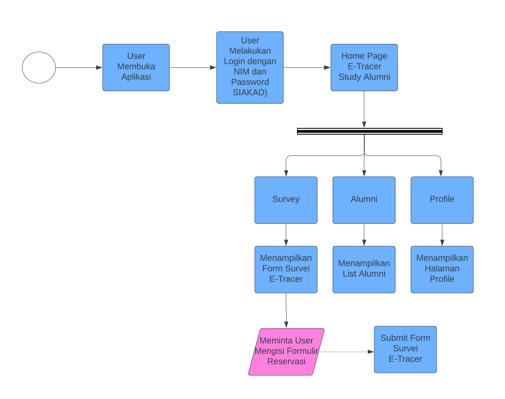

# Flutter Mobile Apps E-Tracer Study Alumni Universitas Esa Unggul
**Business Domain:** Mobile Apps E-Tracer Alumni 
**Business Process:** Alumni Tracer Survey 
**Status:** Release November 2024 
**Version 1**

## Introduction
E-Tracer Study Alumni adalah aplikasi mobile berbasis Flutter yang digunakan untuk mengumpulkan data alumni, seperti informasi karir atau pekerjaan mereka setelah lulus. Tujuan utamanya adalah untuk memantau perkembangan alumni dan mengevaluasi kualitas pembelajaran serta pelayanan akademik dan non-akademik di tingkat Fakultas, Prodi, dan Universitas. Dengan aplikasi ini, pihak universitas dapat lebih mudah melacak alumni, mengetahui sebaran alumni yang bekerja atau berwirausaha, dan mendapatkan informasi yang berguna untuk meningkatkan kualitas pendidikan.

## Objective
Tujuan dari dibentuknya layanan ini adalah
1.	Mempermudah Pelacakan Alumni
Menyederhanakan proses pengisian data alumni melalui antarmuka aplikasi yang mudah digunakan. Mengumpulkan data berupa biodata alumni, pekerjaan alumni, dan feedback kepada pihak kampus.
2.	Meningkatkan Efisiensi
Memudahkan universitas dalam melacak sebaran alumni yang bekerja atau berwirausaha, guna meningkatkan kualitas pendidikan dan pelayanan karena aplikasi ini dimanfaatkan juga sebagai wadah bagi alumni untuk memberikan umpan balik atau kontribusi bagi perkembangan universitas.

## Scope
Batasan dan kriteria pada layanan e-tracer study alumni ini adalah
1.	Akses dan Hak Pengguna
Aplikasi E-Tracer Study Alumni hanya dapat diakses oleh alumni kampus. Setiap pengguna harus login terlebih dahulu menggunakan Nomor Induk Mahasiswa (NIM) dan kata sandi yang sama dengan yang digunakan untuk login sistem akademik mahasiswa (SIAKAD).
2.	Data Terbatas pada Alumni Terkait Karir Alumni
Aplikasi ini fokus pada data terkait karir alumni, tidak mencakup informasi pribadi sensitif atau data lain yang berada di luar tujuan tracer study.

## Business Requirement

### Business Requirement Definition
- **Jenis Layanan:** E-Tracer Study Alumni Universitas Esa Unggul
- **Definisi:** E-Tracer Study Alumni adalah aplikasi mobile berbasis Android yang digunakan untuk merekam data alumni, termasuk biodata alumni, pekerjaan alumni, dan umpan balik dari alumni.
- **Abstrak:** E-Tracer Study Alumni adalah aplikasi mobile yang dirancang untuk membantu universitas dalam melacak jejak alumni. Aplikasi ini memungkinkan alumni untuk mengisi data terkait biodata, riwayat pekerjaan, dan memberikan umpan balik terhadap pengalaman akademik maupun pelayanan kampus. Informasi yang dikumpulkan akan digunakan untuk evaluasi kualitas pendidikan, perbaikan pelayanan, serta pengambilan keputusan strategis oleh universitas. Dengan antarmuka yang sederhana dan mudah digunakan, aplikasi ini bertujuan menciptakan hubungan yang lebih erat antara alumni dan institusi.

### Penjelasan Fungsi
#### Fungsi Teknis
1. **Pengisian Data Alumni** 
  Aplikasi menyediakan beberapa formulir untuk pengisian data penting oleh alumni, meliputi biodata pribadi seperti nama, NIM, jurusan, tahun lulus, dan IPK terakhir. Selain itu, alumni dapat mengisi informasi pekerjaan mereka, seperti nama perusahaan, posisi, dan lokasi kerja sehingga data alumni dapat tercatat dengan lengkap.
2. **Feedback dan Evaluasi** 
  Pada bagian pengisian survei, aplikasi ini memungkinkan alumni memberikan masukan berupa kritik dan saran tentang pengalaman akademik dan layanan kampus. Selain itu, aplikasi menyediakan bagian untuk mengukur kepuasan alumni terhadap dukungan universitas dalam mempersiapkan alumni memasuki dunia kerja.
3. **Notifikasi Login** 
  Aplikasi ini memiliki fitur notifikasi yang muncul saat pengguna berhasil login. Notifikasi ini dibuat menggunakan Firebase dan ditampilkan sebagai notifikasi lokal di perangkat pengguna.
4. **List Alumni** 
  Aplikasi ini memiliki halaman alumni yang menampilkan daftar-daftar alumni dengan detail nama, tahun kelulusan, posisi/jabatan, perusahaan tempat bekerja, dan kontak yang dapat dihubungi.
5. **Halaman Profile** 
  Aplikasi ini memiliki halaman profil yang menampilkan data dasar alumni, seperti NIM, nama, tahun kelulusan, dan kontak alumni, termasuk alamat email kampus yang digunakan saat menjadi mahasiswa.

#### Fungsi Strategis
1. **Peningkatan Kualitas Pendidikan dan Layanan Kampus** 
  Dengan mengumpulkan umpan balik dari alumni mengenai pengalaman akademik dan layanan kampus, aplikasi ini memberikan wawasan yang berharga bagi universitas untuk mengevaluasi dan memperbaiki kualitas pendidikan serta fasilitas yang ada. Hal ini dapat digunakan sebagai dasar untuk merancang program perbaikan yang lebih efektif, baik di tingkat fakultas maupun universitas.
2. **Pemantauan Jejak Alumni** 
  Aplikasi ini membantu universitas memantau perkembangan karir alumni dengan menyimpan data pekerjaan seperti nama perusahaan, posisi/jabatan, dan lokasi kerja. Informasi ini dapat memberikan gambaran yang jelas tentang keberhasilan alumni dalam memasuki dunia kerja, serta memperlihatkan sebaran alumni di berbagai bidang dan lokasi geografis, yang dapat mendukung keputusan strategis terkait kurikulum dan pelatihan di masa depan.
3. **Peningkatan Jaringan Alumni** 
  Dengan menyediakan platform bagi alumni untuk mengisi data diri dan memberikan umpan balik, aplikasi ini memperkuat hubungan antara alumni dan kampus. Hal ini membuka peluang untuk membangun komunitas alumni yang lebih solid, yang pada nantinya dapat berkontribusi dalam pengembangan kampus.
4. **Evaluasi Program Universitas dalam Mempersiapkan Alumni** 
  Survei kepuasan alumni terhadap dukungan universitas dalam mempersiapkan mereka menghadapi dunia kerja memberikan data penting yang dapat digunakan oleh pihak universitas untuk menilai efektifitas program-program pendidikan dan pengembangan karir. Dengan informasi ini, universitas dapat meningkatkan program magang, bimbingan karir, dan kemitraan dengan industri untuk lebih menyelaraskan kurikulum dengan kebutuhan pasar kerja.

### Fungsional dan Spesifikasi Kebutuhan Bisnis
#### Business Process Flow

#### Spesifikasi Kebutuhan Bisnis
Aplikasi E-Tracer Study Alumni bertujuan untuk menyediakan akses yang mudah dan terpusat bagi alumni untuk mengisi data pribadi, pekerjaan, serta memberikan umpan balik mengenai pengalaman akademik dan pelayanan kampus.

Dari segi teknis, aplikasi ini memungkinkan alumni untuk dengan mudah mengisi data seperti biodata, informasi pekerjaan, dan memberikan umpan balik. Alumni juga dapat mengakses daftar alumni dan halaman profil mereka.

Secara strategis, aplikasi ini memberikan manfaat yang signifikan bagi universitas. Dengan mengumpulkan data alumni yang lengkap dan terstruktur, universitas dapat memantau perkembangan karir alumni, mengevaluasi kepuasan alumni terhadap kualitas pendidikan, serta meningkatkan layanan akademik dan non-akademik berdasarkan umpan balik yang diberikan. Informasi yang dikumpulkan dari aplikasi ini akan membantu universitas dalam pengambilan keputusan yang lebih baik untuk perbaikan program studi dan pengembangan fasilitas yang lebih relevan dengan kebutuhan dunia kerja.

Secara keseluruhan, aplikasi E-Tracer Study Alumni ini tidak hanya akan meningkatkan efisiensi pengelolaan data alumni dan memperkuat hubungan alumni dengan universitas, tetapi juga mendukung upaya universitas untuk terus meningkatkan kualitas pendidikan dan layanan yang diberikan kepada mahasiswa dan alumni. Aplikasi ini juga memberikan dasar yang kuat bagi universitas untuk mengoptimalkan strategi pendidikan dan memperkuat branding kampus melalui keberhasilan alumni di dunia kerja.

#### Fungsional dan Proses
1. **Pengisian Data Alumni**
    - **Fungsional:** Memfasilitasi pencatatan dan pemantauan data alumni, termasuk informasi pribadi, pekerjaan, serta feedback atau survei yang diberikan oleh alumni.
    - **Proses:** User dapat mengisi survei yang terdiri dari nama, NIM, jurusan, tahun kelulusan, serta informasi pekerjaan.
2. **Feedback dan Evaluasi**
    - **Fungsional:** Aplikasi memungkinkan alumni untuk memberikan masukan berupa kritik dan saran terkait pengalaman akademik dan layanan kampus. Selain itu, aplikasi ini juga menyediakan fitur untuk mengukur tingkat kepuasan alumni terhadap dukungan yang diberikan universitas dalam mempersiapkan mereka menghadapi dunia kerja. Data dari umpan balik ini digunakan untuk evaluasi dan perbaikan kualitas pendidikan dan layanan kampus.
    - **Proses:** Alumni dapat mengakses bagian survei pada aplikasi. Pada bagian akhir survei, alumni dapat mengisi bagian kritik dan saran yang ditujukan kepada pihak kampus.
3. **Notifikasi Login**
    - **Fungsional:** Aplikasi ini menampilkan notifikasi kepada pengguna setelah berhasil login. Notifikasi ini menggunakan Firebase untuk pengiriman dan ditampilkan sebagai notifikasi lokal di perangkat pengguna.
    - **Proses:** Setelah pengguna berhasil login menggunakan NIM dan password, aplikasi akan mengirimkan notifikasi lokal ke perangkat pengguna menggunakan Firebase. Notifikasi ini muncul di layar perangkat sebagai tanda bahwa login telah berhasil. Pengguna dapat melihat notifikasi tersebut, yang akan hilang secara otomatis setelah beberapa detik, atau mereka bisa menutupnya secara manual.
4. **List Alumni**
    - **Fungsional:** Aplikasi ini menyediakan halaman yang menampilkan daftar alumni lengkap dengan informasi seperti nama, tahun kelulusan, posisi atau jabatan, perusahaan tempat bekerja, dan kontak yang dapat dihubungi.
    - **Proses:** Setelah pengguna mengakses halaman alumni, aplikasi akan menampilkan daftar alumni beserta informasi seperti nama, tahun kelulusan, jabatan, perusahaan, dan kontak.
5. **Halaman Profile**
    - **Fungsional:** Aplikasi menyediakan halaman profil yang menampilkan data dasar alumni, seperti NIM, nama, tahun kelulusan, dan kontak alumni, termasuk alamat email kampus yang digunakan saat menjadi mahasiswa.
    - **Proses:** Setelah pengguna membuka halaman profil, aplikasi akan menampilkan informasi dasar mereka, yang meliputi NIM, nama, tahun kelulusan, dan kontak yang terkait, termasuk email kampus. Pengguna dapat memperbarui data mereka jika diperlukan.

### Usability and Performance Requirements
#### Usability and Humanity Requirement
- **Ease of Use Requirement**
    - **Antarmuka yang sederhana:** antarmuka harus dirancang dengan tampilan yang sederhana, mudah dimengerti, dan mudah dinavigasi.
    - **Proses pengisian survei yang mudah:** pengguna harus dapat dengan mudah mengisi formulir input data yang berisikan atribut dari masing-masing tabel.
    - Mengaplikasikan kombinasi warna yang menarik dan memberikan cukup kontras agar mudah dibaca.
#### Maintainability and Support Requirement
1. Terdapat catatan yang jelas pada tiap proses yang terjadi.

### Portabilty Requirement
Aplikasi ini dapat diakses melalui sistem operasi Android.